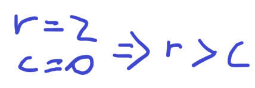
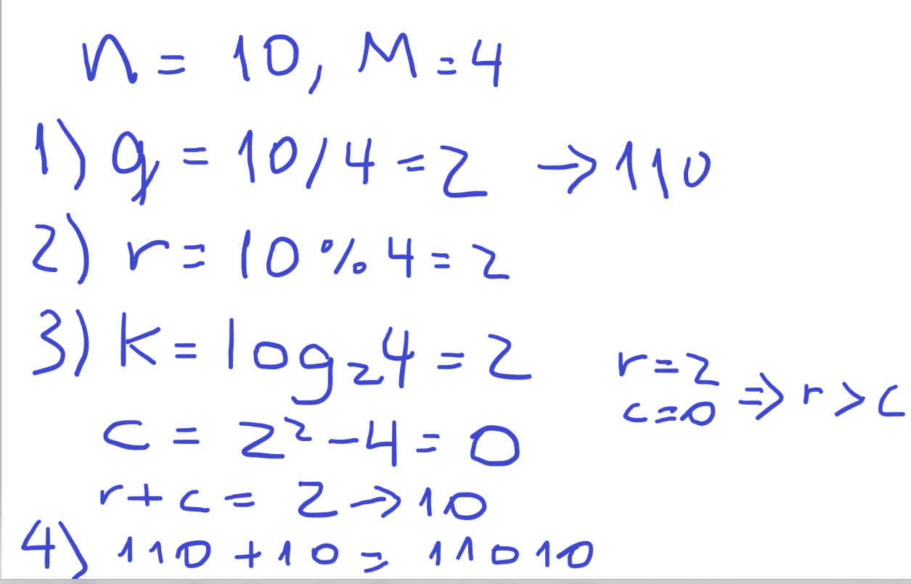

# Golomb Coding

## Definición del código

El código Golomb es un código de longitud variable, similar a Huffman; sin embargo, en lugar de basarse en los datos, como Huffman, se basa en la probabilidad de los valores: los valores pequeños son más probables que los grandes. Esta relación se define mediante un parámetro conocido como el divisor.

Para llevar a cabo la codificación, es necesario encontrar el cociente y el resto de la división del valor a codificar por el divisor. Luego, se representa el cociente en notación unaria, añadiendo un bit de parada al final. Si la codificación unaria utiliza 1s, el bit de parada es 0; en cambio, si se utiliza 0s, el bit de parada es 1. El resto se representa en notación binaria truncada, y su longitud puede determinarse a partir del divisor. Finalmente, la codificación unaria del cociente se suma a la codificación binaria truncada del resto para obtener la secuencia de salida.

## Ejemplo de aplicación

Ejemplo con $n=10$ y $M=4$

### PASO 1: Calcular el Cociente

Calcular el cociente $q$ dividiendo $n$ entre $M$

- $q = \frac{10}{4} = 2$


### PASO 2: Calcular el Resto

Calcular el resto $r$ usando el operador módulo entre $n$ y $M$

- $r = 10 \bmod 4 = 2$


### PASO 3: Codificar Unariamente el Cociente

Codificar unariamente el cociente $q$, agregando $q$ unos seguidos de un cero al final. Otra opción es agregar ceros y un uno al final

- $q = 2 \rightarrow 110 $


### PASO 4: Calcular Codificación Binaria Truncada del Resto

####

Calcular $k$, que es $\log_2(M)$

- $k = \log_2(4) = 2$


####

Calcular $c = 2^k - M$

- $c = 2^2 - 4 = 0$


####

Evaluar si $0 \leq r < c$, si es así, $r$ se trunca en $k-1$ bits; de lo contrario, $r + c$ se trunca en $k$ bits.

- $r = 2$, $c = 0$, y $r > c$, por lo que $r+c=2$ se trunca en $k=2$ bits, bit: `10`




### PASO 5: Combinar Codificaciones

Sumar la codificación unaria de $q$ con la codificación binaria del resto.

- $110 + 10 = 11010$


### Desarrollo Completo

El desarrollo completo del ejemplo se presenta a continuación:



## Implementación del código

A continuación, se presenta una implementación en Python:

```python
def golomb_encode(number, M):
    # Paso 1: Calcular el cociente y el resto
    quotient = number // M
    remainder = number % M

    # Paso 2: Codificación unaria del cociente
    unary_code = "1" * quotient + "0"

    # Paso 3: Codificación binaria del resto
    binary_code = bin(remainder)[2:]  # Convertir a binario y eliminar el prefijo '0b'

    # Ajustar la longitud de la cadena binaria si es necesario
    while len(binary_code) < M.bit_length() - 1:
        binary_code = '0' + binary_code

    # Paso 4: Combinar la codificación unaria y binaria para obtener el código Golomb
    golomb_code = unary_code + binary_code

    # Paso 5: Devolver el código Golomb resultante
    return golomb_code

def golomb_decode(golomb_code, M):
    # Obtener la longitud de la codificación unaria
    unary_length = golomb_code.find("0") + 1

    # Calcular el cociente a partir de la longitud de la codificación unaria
    quotient = unary_length - 1

    # Obtener la parte binaria del código Golomb
    binary_code = golomb_code[unary_length:unary_length + M.bit_length() - 1]

    # Convertir la parte binaria a un número entero
    remainder = int(binary_code, 2)

    # Calcular el número decodificado
    decoded_number = quotient * M + remainder

    # Devolver el número decodificado
    return decoded_number
```

Esta implementación toma un número entero no negativo y un parámetro M, devolviendo su representación en Golomb Coding y permitiendo su decodificación.

## Referencias

- Golomb, Solomon W. (1966). ["Run-length encodings". IEEE Transactions on Information Theory, IT--12(3), 399--401](https://urchin.earth.li/~twic/Golombs_Original_Paper/)
